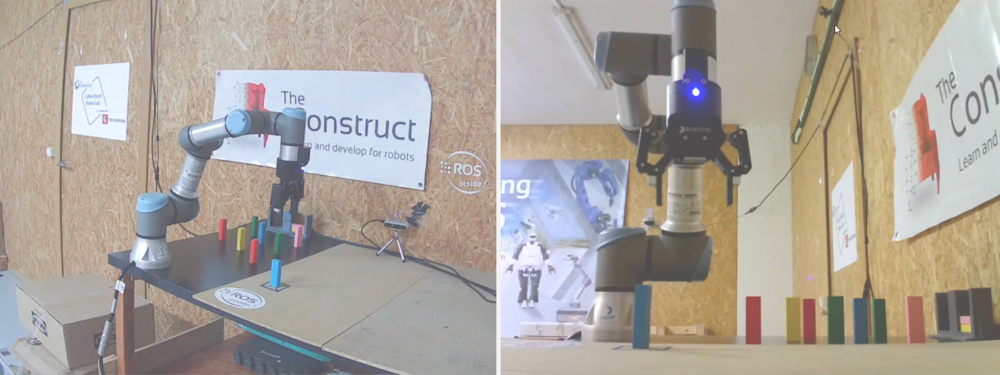

# CheckPoint 7 Manipulation Perception

<a name="readme-top"></a>

## About The Project
The purpose of this project is to use Moveit2 to generate a basic Pick & Place task with a UR3e robotic arm. The task involves picking an object from the table and placing it in a different location. The Move Group Interface API is utilized to combine a series of motions to generate the pick & place sequence. Additionally, a perception node is integrated into the sequence to enable the robot to detect the position of the object to be picked.



<!-- GETTING STARTED -->
## Getting Started

### Software Prerequisites
* Ubuntu 22.04
* ROS2 Humble


<p align="right">(<a href="#readme-top">back to top</a>)</p>

<!-- INSTALLATION -->
### Installation
1. Clone the repo:
   ```sh
   cd ~ && \
   git clone https://github.com/pvela2017/The-Construct-CheckPoint-7-Manipulation-Perception
   ```
2. Compile the simulation:
   ```sh
   source /opt/ros/humble/setup.bash && \
   cd ~/The-Construct-CheckPoint-7-Manipulation-Perception/ros2_ws && \
   colcon build
   ```
     
<p align="right">(<a href="#readme-top">back to top</a>)</p>


<!-- USAGE -->
## Usage
### Local Simulation & Real Robot
1. Launch the simulation:
   ```sh
   source /opt/ros/humble/setup.bash && \
   source ~/The-Construct-CheckPoint-7-Manipulation-Perception/ros2_ws/install/setup.bash && \
   ros2 launch the_construct_office_gazebo warehouse_ur3e.launch.xml
   ```
2. Launch move group:
   ```sh
   source /opt/ros/humble/setup.bash && \
   source ~/The-Construct-CheckPoint-7-Manipulation-Perception/ros2_ws/install/setup.bash && \
   ros2 launch my_moveit_config move_group.launch.py    # simulation
   ros2 launch real_moveit_config move_group.launch.py  # real
   ```
3. Launch moveit rviz interface:
   ```sh
   source /opt/ros/humble/setup.bash && \
   source ~/The-Construct-CheckPoint-7-Manipulation-Perception/ros2_ws/install/setup.bash && \
   ros2 launch my_moveit_config moveit_rviz.launch.py    # simulation
   ros2 launch real_moveit_config moveit_rviz.launch.py  # real
   ```
4. Pick and Place without perception:
   ```sh
   source /opt/ros/humble/setup.bash && \
   source ~/The-Construct-CheckPoint-7-Manipulation-Perception/ros2_ws/install/setup.bash && \
   ros2 launch moveit2_scripts pick_and_place_sim.launch.py    # simulation
   ros2 launch moveit2_scripts pick_and_place.launch.py        # real
   ```
6. Launch perception:
   ```sh
   source /opt/ros/humble/setup.bash && \
   source ~/The-Construct-CheckPoint-7-Manipulation-Perception/ros2_ws/install/setup.bash && \
   ros2 launch get_cube_pose get_pose_client.launch.py    # simulation
   ```   
7. Pick and Place with perception:
   ```sh
   source /opt/ros/humble/setup.bash && \
   source ~/The-Construct-CheckPoint-7-Manipulation-Perception/ros2_ws/install/setup.bash && \
   ros2 launch moveit2_scripts pick_and_place_perception_sim.launch.py    # simulation
   ros2 launch moveit2_scripts pick_and_place_perception.launch.py        # real
   ```

<p align="right">(<a href="#readme-top">back to top</a>)</p>

<!-- RESULTS -->
## Results
[](https://www.youtube.com/watch?v=s4jkbh0bWyQ)

<!-- KEYS -->
## Key topics learnt
* Moveit2.
* Perception.
